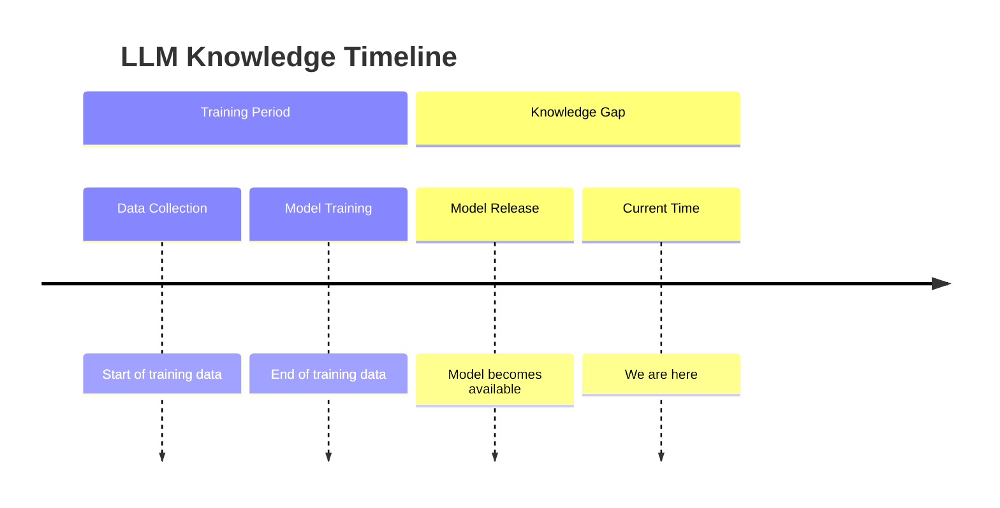
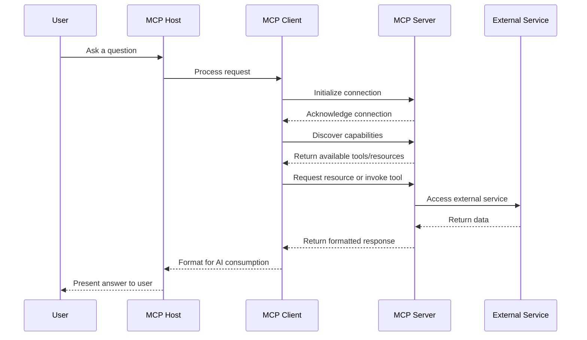

# Model Context Protocol (MCP) Workshop Guide

## Introduction to MCP

Model Context Protocol (MCP) represents a significant advancement in how we connect AI language models with external data sources and tools. If you've worked with any API Framework, you'll appreciate how MCP standardises interactions between LLMs and external systems, much like how REST Framework standardises API development.

At its heart, MCP is an open protocol introduced by Anthropic in late 2024 that standardises how applications provide context to LLMs (Large Language Models). Think of it as a universal connector—like a USB-C port for AI applications—providing a standardised way to connect AI models to different data sources and tools.

## Why LLMs Need MCP

### Understanding LLM Limitations

Large Language Models face several key limitations:

1. **Knowledge Cut-off** - Models are only trained on data available before a specific date
2. **No Real-time Information** - They can't access current data without external help
3. **Hallucinations** - They may generate plausible but incorrect information
4. **No External Tools** - They can't directly interact with other systems

While Retrieval-Augmented Generation (RAG) helps LLMs access external information, it's still limited to a retrieve-then-generate pattern. MCP takes this further by enabling true bidirectional interaction with external systems.

### The Knowledge Gap Problem



This creates an "information gap" between the model's training cutoff and the present day. For instance:

- Claude 3 models: Trained on data up to around October 2024
- GPT-4 models: Data cutoff approximately April 2023

## MCP Architecture

MCP follows a client-server architecture where a host application can connect to multiple servers:


This separation of concerns allows the LLM to remain focused on reasoning while dedicated servers handle specific functionalities.

### Core Components

1. **MCP Hosts**: Programs like Claude Desktop, IDEs, or AI tools that want to access data through MCP
2. **MCP Clients**: Protocol clients that maintain 1:1 connections with servers
3. **MCP Servers**: Lightweight programs that expose specific capabilities through the standardised protocol
4. **Local Data Sources**: Your computer's files, databases, and services that MCP servers can securely access
5. **Remote Services**: External systems available over the internet that MCP servers can connect to

### MCP vs Traditional APIs

|Feature|Traditional APIs|Model Context Protocol|
|---|---|---|
|Purpose|Machine-to-machine communication|AI-to-tool communication|
|Design|Often complex, technical schemas|Human-readable descriptions|
|Discovery|Static documentation|Dynamic discovery via protocol|
|Focus|Data structure & efficiency|Ease of use by AI models|
|Authentication|Various methods (keys, OAuth, etc.)|Standardised permissions model|
|Context|Stateless, minimal context|Context-aware interactions|
|Interface|Technical (REST, GraphQL, etc.)|Natural language friendly|

## MCP Communication Flow

Understanding the interaction flow is crucial for grasping how MCP works:



The detailed communication flow follows this sequence:

1. **User Initiation**: User asks a question in an MCP-enabled client (like Claude Desktop)
2. **Request Processing**: The host processes the request and passes it to the MCP client
3. **Connection Initialization**: MCP client establishes connection with the server
4. **Connection Acknowledgement**: Server acknowledges the connection
5. **Capability Discovery**: Client discovers the available tools and resources
6. **Tool/Resource Response**: Server returns information about available capabilities
7. **Request Invocation**: Client requests a resource or invokes a tool based on user needs
8. **External Service Access**: Server accesses the external service or data source
9. **Data Return**: External service returns data to the server
10. **Formatted Response**: Server returns formatted response to the client
11. **AI Consumption Formatting**: Client formats the response for AI consumption
12. **User Presentation**: Host presents the answer to the user

This flow creates a seamless experience where users can interact with their data and external services through natural language conversations with the LLM.

## Core Capabilities of MCP

MCP servers can provide three main types of capabilities:

### 1. Resources

Resources in MCP are analogous to GET endpoints in a REST API. They provide data to LLMs but shouldn't perform significant computation or have side effects. Resources are identified by URIs and can be static or dynamic.

Example:

```python
@mcp.resource("config://app")
def get_config() -> str:
    """Static configuration data"""
    return "App configuration here"

@mcp.resource("users://{user_id}/profile")
def get_user_profile(user_id: str) -> str:
    """Dynamic user data"""
    return f"Profile data for user {user_id}"
```

### 2. Tools

Tools are how LLMs take actions through your server. Unlike resources, tools are expected to perform computation and have side effects. They're similar to POST endpoints in a REST API.

Example:

```python
@mcp.tool()
def calculate_bmi(weight_kg: float, height_m: float) -> float:
    """Calculate BMI given weight in kg and height in meters"""
    return weight_kg / (height_m**2)
```

Tools are defined with the `@mcp.tool()` decorator, which uses Python type hints and docstrings to automatically generate tool definitions, making them self-documenting and ensuring type safety.

### 3. Prompts

Prompts are reusable templates that help LLMs interact with your server effectively. Think of these as pre-defined conversation starters or workflows.

Example:

```python
@mcp.prompt()
def review_code(code: str) -> str:
    return f"Please review this code:\n\n{code}"
```

## Building Your First MCP Server

Let's look at a simple example of an MCP server - the Boredom Killer we demonstrated in the workshop:

```python
# Initialize our MCP server with a friendly name
mcp = FastMCP("Boredom Killer")

@mcp.tool()
async def kanye_wast_quotes(ctx: Context) -> str:
    """Gets a random Kanye West quote to inspire or amuse."""
    ctx.info("Finding you a Kanye West quote...")

    try:
        async with httpx.AsyncClient() as client:
            response = await client.get(KANYE_API)

            if response.status_code != 200:
                return "Sorry, I couldn't get a Kanye quote right now."

            data = response.json()
            quote = data.get("quote", "")

            return f"Kanye says: {quote}"
    except Exception as e:
        return f"Error getting a Kanye quote: {str(e)}"
```

This example shows how easy it is to create a tool that fetches data from an external API and returns it in a format that's easy for the LLM to understand and incorporate into its responses.

### Setting Up Your Environment

```bash
# Create a virtual environment
python -m venv mcp-workshop
source mcp-workshop/bin/activate  # On Windows: mcp-workshop\Scripts\activate

# Install required packages
pip install "mcp[cli]"
```

### Testing Your MCP Server

```bash
# Start the MCP Inspector
mcp dev your_server.py
```

This will open the MCP Inspector in your web browser, where you can:

1. Connect to your MCP server
2. List available tools and resources
3. Test your tools with different inputs
4. Access your resources

### Integrating with Claude Desktop

1. Install your MCP server for Claude Desktop:

```bash
mcp install your_server.py
```

2. Open Claude Desktop and connect to your server
3. Ask Claude to use your server's capabilities

## Advanced Concepts

### Context Object

The Context object gives your tools and resources access to MCP capabilities:

```python
@mcp.tool()
async def long_task(files: list[str], ctx: Context) -> str:
    """Process multiple files with progress tracking"""
    for i, file in enumerate(files):
        ctx.info(f"Processing {file}")
        await ctx.report_progress(i, len(files))
        data, mime_type = await ctx.read_resource(f"file://{file}")
    return "Processing complete"
```

The Context object provides methods for reporting progress, logging information, and accessing other resources, making it easier to build complex tools.

### Lifespan Management

For more complex applications, you might need to manage application lifecycle with type-safe context:

```python
@asynccontextmanager
async def app_lifespan(server: FastMCP) -> AsyncIterator[AppContext]:
    """Manage application lifecycle with type-safe context"""
    # Initialize on startup
    db = await Database.connect()
    try:
        yield AppContext(db=db)
    finally:
        # Cleanup on shutdown
        await db.disconnect()

# Pass lifespan to server
mcp = FastMCP("My App", lifespan=app_lifespan)
```

This pattern is particularly useful when you need to manage connections to databases or other external services.

## Key Advantages of MCP

1. **Standardization**: Reduces the "M×N problem" of needing custom integrations for every AI-tool combination
2. **More Relevant AI**: Allows AI to access up-to-date information beyond its training data
3. **Two-way Communication**: Not just passive retrieval, but active tool use
4. **User Control**: Permissions model for granting access to sensitive data
5. **Maintainability**: Fewer integration failures, easier debugging
6. **Separation of Concerns**: Clear separation between data access and computation

## Conclusion

Model Context Protocol represents a significant step forward in AI integration. By providing a standardised way for LLMs to interact with external systems, MCP enables developers to build more powerful, secure, and maintainable AI applications.

As you continue exploring MCP, remember that it's designed to be extensible. You can build servers that expose domain-specific resources and tools, connect them to various LLM clients, and create rich, interactive experiences for your users.

MCP's approach of separating the AI reasoning layer from the data and tools layers is particularly powerful because it allows each component to evolve independently. This separation of concerns, combined with the protocol's focus on security and standardisation, makes MCP an excellent foundation for building the next generation of AI applications.

## Resources

- [Model Context Protocol Documentation](https://docs.anthropic.com/en/docs/agents-and-tools/mcp)
- [MCP GitHub Repository](https://github.com/modelcontextprotocol)
- [MCP Python SDK](https://github.com/modelcontextprotocol/python-sdk)
- [Anthropic Claude Desktop](https://www.anthropic.com/claude)
- [Cursor IDE](https://cursor.sh/)